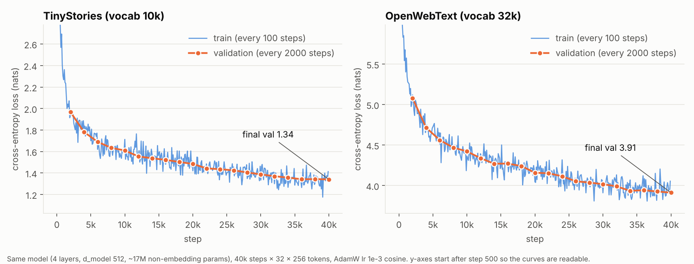

# CS336 Assignment 1: Basics

My implementation of Stanford CS336 (Spring 2025) Assignment 1: a byte-level BPE tokenizer, a Transformer language model, AdamW, and the training loop, all written from scratch in PyTorch. The original starter code is from the [course repo](https://github.com/stanford-cs336/assignment1-basics).

## Results

Same model on both datasets: 4 layers, d_model 512, about 17M non-embedding parameters, 40k steps × 32 × 256 tokens, AdamW with lr 1e-3 cosine schedule.

| Dataset | BPE vocab | Final val loss |
|---|---|---|
| TinyStories | 10k | **1.34** |
| OpenWebText | 32k | **3.91** |

Full training logs: [ts_log.txt](ts_log.txt), [owt_log.txt](owt_log.txt).

## Layout

- `cs336_basics/train_bpe.py`, `owt_bpe.py`: BPE training
- `cs336_basics/tokenizer.py`: encode / decode
- `cs336_basics/encode_data.py`, `encode_parallel.py`: tokenize datasets to `.npy`
- `cs336_basics/model.py`: Transformer LM
- `cs336_basics/train.py`, `train_lm.py`: optimizer and training loop
- `cs336_basics/gen.py`: text generation
- `tests/adapters.py`: my glue between the course unit tests and this code
- `*_vocab.pkl`, `*_merges.pkl`: trained BPE tokenizers

Model checkpoints (`ts_ckpt.pt`, `owt_ckpt.pt`) are too large for git and are attached to the GitHub Release.

## Running

This repo only contains my own code. To run the unit tests, copy `tests/adapters.py` into a checkout of the [course repo](https://github.com/stanford-cs336/assignment1-basics) along with `cs336_basics/`, then `uv run pytest`.

Data download instructions are in the [course repo](https://github.com/stanford-cs336/assignment1-basics#download-data); put files under `data/`.
